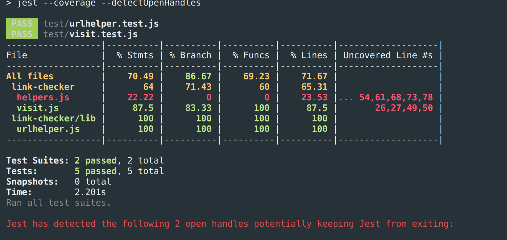

# Link Checker
Simple proof of concept to scan a url, and extract it's links to a standard output

## Notes & Usage
- Requires node 10+ for URL usage
- Derek steered me away from a 'production' solution using docker, queue server, and far more validation/threading/memory checks etc
- This will fail if you hit a production site like reddit.com, their firewalls will prevent too many requests, to test, use a smaller site
- this should not be an on-demand service, but instead a scheduled service that continually updates a sitemap with better controlls
- converted test suit to Jest for better async handling and nock support

### Module Usage
```javascript 
yarn install
npm test
```


```javascript
const visit = require('./visit');
async () => {
    try {
        const links = await visit(url);
        // loop/reduce your links here
    } catch( e ) {
        // Handle any **errors**
    }
 }

```

### CLI Usage
```javascript
nvm use 10
yarn install
node cli.js -u https://oddball.io
```

## TODOS
- [ ] Convert to typescript
- [ ] Offload child primises to queue server
- [ ] Add throttling and concurrency
- [ ] Handle files other than pages
- [ ] come up with error handling for modified date

## Examples

